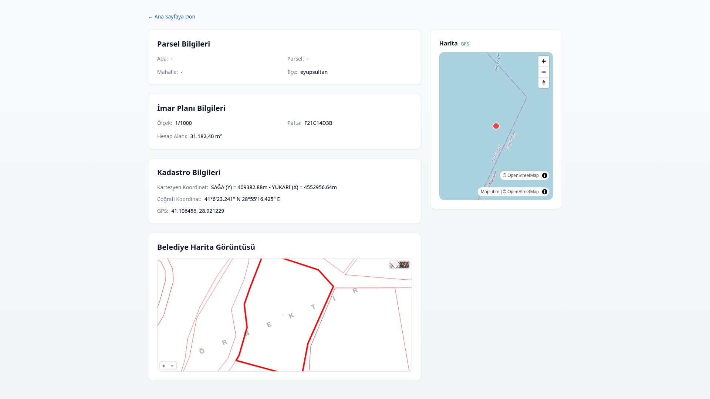

# 🏛️ EIMAR - İstanbul E-İmar Hub

## Tek Platformdan İstanbul'un Tüm İlçelerinin İmar Bilgilerine Erişin

---

## 📱 Ana Sayfa


Eimar, İstanbul'un **39 ilçesinin** imar bilgilerine tek bir platformdan erişmenizi sağlayan modern bir web uygulamasıdır.

---

## 🔍 Arama Sonuçları


Ada/Parsel numarası ile hızlı arama yapın ve sonuçları anında görüntüleyin.

---

## 📊 Detaylı Parsel Görünümü



Her parsel için kapsamlı bilgi:
- İmar planı bilgileri (ölçek, pafta, hesap alanı)
- Kadastro bilgileri (Kartezyen ve coğrafi koordinatlar)
- GPS konum bilgisi
- Belediye harita görüntüsü

---

## ✨ Temel Özellikler

- **Akıllı Arama**: Ada/Parsel numarası veya adres ile parsel arama
- **Performans**: Hızlı arama sonuçları ve önbellek desteği
- **Çoklu Platform**: KEOS v2, KEOS v3, GiSoft CBS, Moskbilisim platformlarını destekler
- **Responsive Tasarım**: Mobil ve masaüstü uyumlu arayüz

---

## 🛠️ Teknik Özellikler

| Özellik | Detay |
|---------|-------|
| Framework | Next.js 14 (App Router) |
| Dil | TypeScript |
| Stil | Tailwind CSS |
| Harita | MapLibre GL |
| Veri Kaynağı | İstanbul belediyeleri API'leri |
| Önbellek | JSON tabanlı yerel önbellek |

---

## 🚀 Kurulum

```bash
# Depoyu klonlayın
git clone https://github.com/.../eimar_real.git

# Dizinine girin
cd eimar_real

# Bağımlılıkları yükleyin
npm install

# Geliştirme sunucusunu başlatın
npm run dev
```

Uygulama `http://localhost:3000` adresinde çalışacaktır.

---

## 📞 İletişim

Sorularınız veya önerileriniz için: [GitHub Issues](https://github.com/.../issues)


